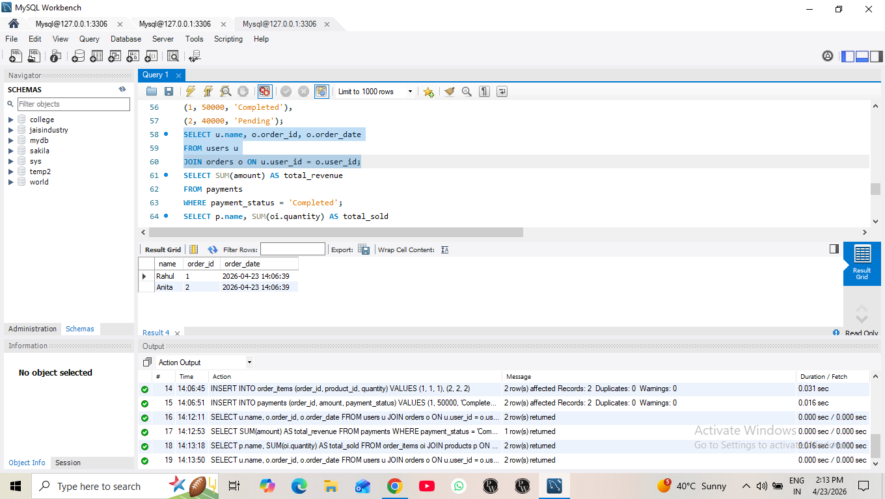
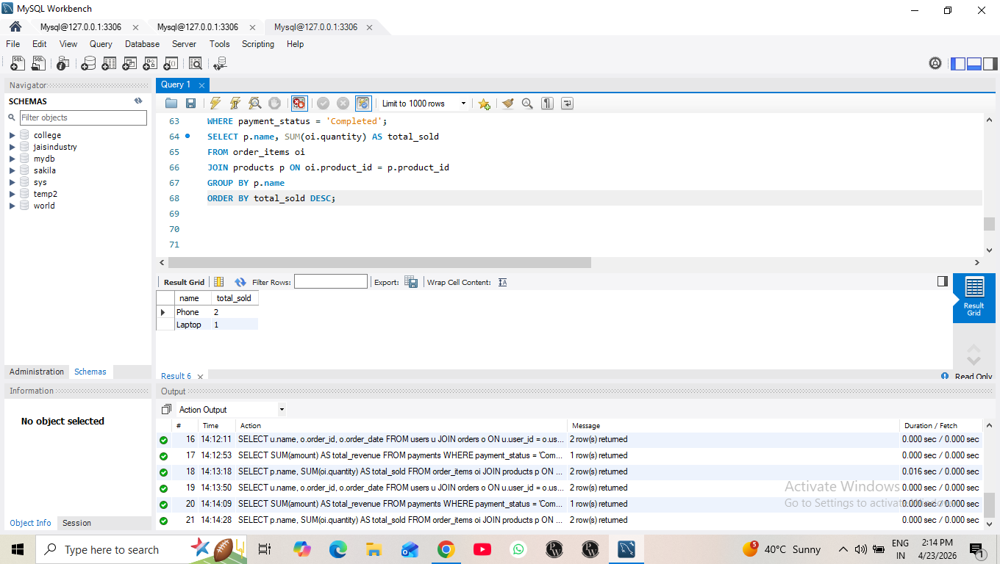

# ecommerce-db
project : E-commerce database (my sql)
🛒 E-commerce Database System (MySQL)

📌 Description

This project is a relational database system for an e-commerce platform. It manages users, products, orders, and payments.

🧱 Features

- User and product management
- Order tracking system
- Payment handling
- Revenue analysis
- Stock auto-update using trigger

🛠️ Tech Used

- MySQL

📊 Sample Queries

- Total revenue calculation
- Top-selling products
- Customer order history

🚀 How to Run

1. Import schema.sql
2. Run data.sql
3. Execute queries.sql

 ##Screenshots##
  
 #user table 
 
  
 ## query output 
 
